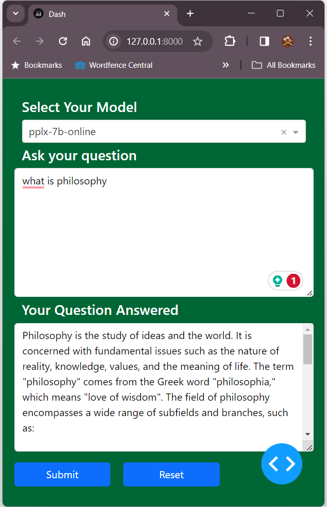

# Perplexity AI API Test Code
<<<<<<< HEAD
Sample code utilising Perplexity API

You need a perplexity API key for this code to work. This [document](https://docs.perplexity.ai/docs/getting-started) takes you through getting an API key' 

The article [Introducing pplx-api](https://blog.perplexity.ai/blog/introducing-pplx-api) is a good introduction

Apart from that its all pretty standard stuff. 

The 9 models that are available currently (31/01/2024) are:

| # |          model         |
|---|:----------------------:|
| 1 | codellama-34b-instruct |
| 2 |    llama-2-70b-chat    |
| 3 |   mistral-7b-instruct  |
| 4 |      pplx-7b-chat      |
| 5 |     pplx-7b-online     |
| 6 |      llava-7b-chat     |
| 7 |  mixtral-8x7b-instruct |
| 8 |     mistral-medium     |
| 9 |         related        |

(width=375)

